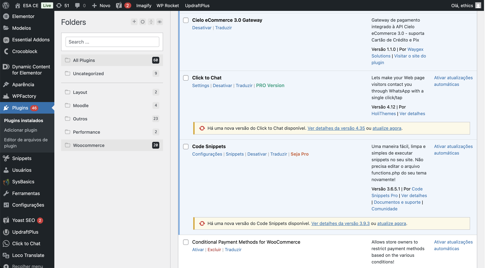
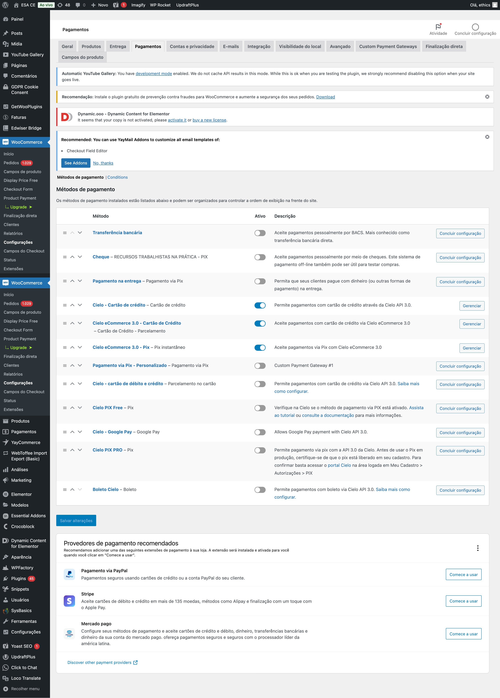
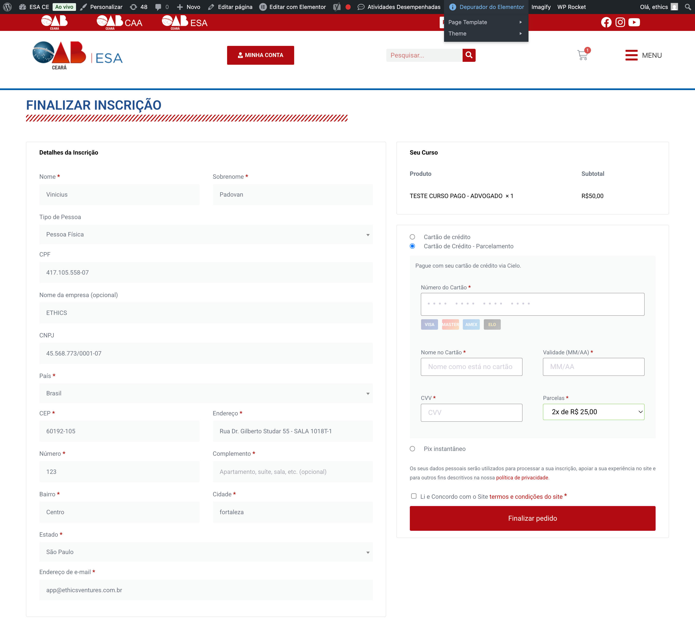
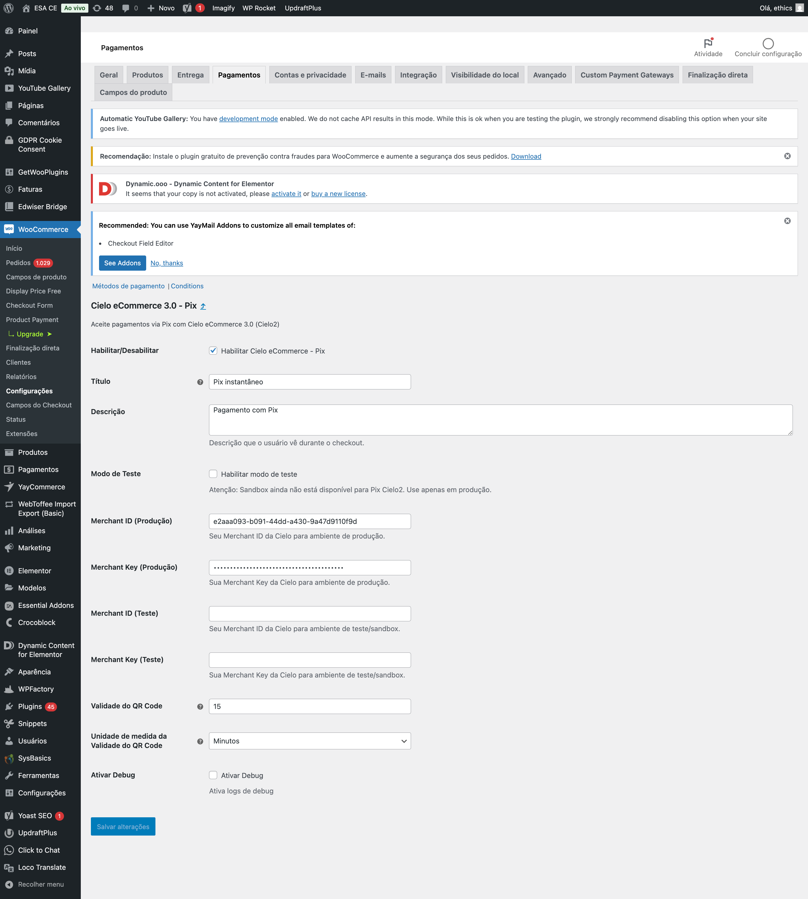
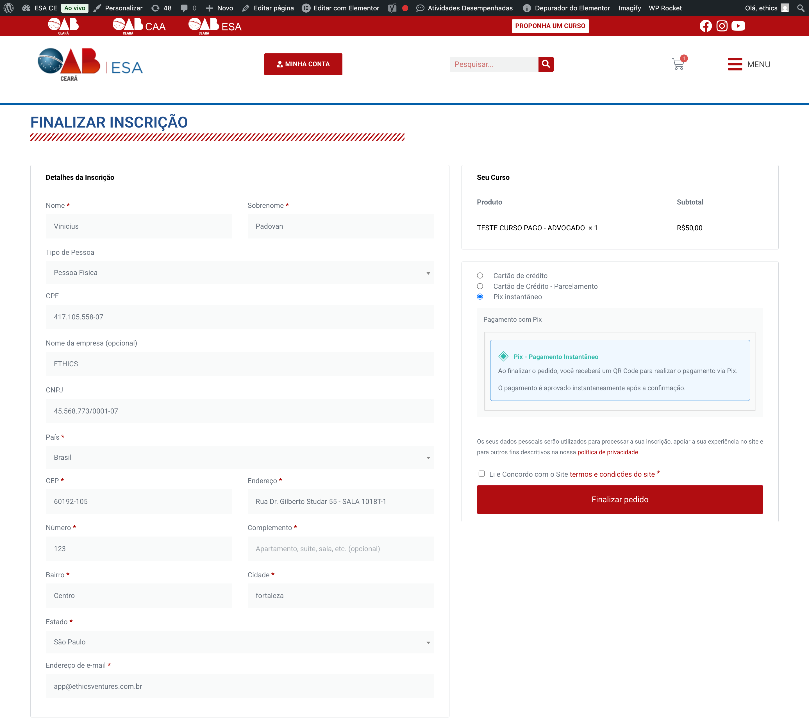
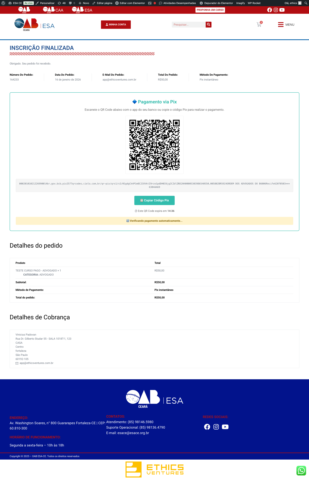

# Cielo 3.0 WooCommerce Payment Gateway Integration

Esse projeto trata-se de um plugin de WordPress para habilitar o WooCommerce para pagamentos via Cartão de Crédito e Pix com a API Cielo 3.0 Ecommerce.

## Requisitos

* WordPress 5.0+
* WooCommerce 9.4+
* Conta ativa Cielo Ecommerce

## Ativação do plugin

1. Certifique-se que o plugin ```Cielo eCommerce 3.0 Gateway``` está instalado e ativo.

    

2. Abra o menu WooCommerce / Pagamentos para ver os novos gateways:

    * Cielo eCommerce 3.0 - Cartão de Crédito
    * Cielo eCommerce 3.0 - Pix

3. Escolha o gateway para configurar e pressione "Concluir configuração" ou "Gerenciar"

    

## Configurações do gateway: Cartão de Crédito

O plugin permite configurações personalizadas para necessidades diversas, tais quais:

* Ativo ou inativo
* Nome de exibição do método de pagamento
* Ativar teste (padrão desligado)
* Merchant ID / Merchant Key (Produção) (credenciais Cielo)
* Merchant ID / Merchant Key (Teste) (credenciais Cielo)
* Código do estabelecimento (opcional)
* Descrição na fatura
* Número máximo de parcelas (máximo de 12x)
* Valor mínimo da parcela (mínimo R$ 5,00)
* Ativar Debug (padrão desligado)

    

## Exemplo de uso: Cartão de Crédito



## Configuração Pix

O plugin permite configurações personalizadas para necessidades diversas, tais quais:

* Ativo ou inativo
* Nome de exibição do método de pagamento
* Ativar teste (padrão desligado)
* Merchant ID / Merchant Key (Produção) (credenciais Cielo)
* Merchant ID / Merchant Key (Teste) (credenciais Cielo)
* Validade do QR Code (número)
* Unidade de medida da Validade do QR Code -> determina se a validade é dada em minutos ou horas.
* Ativar Debug (padrão desligado)

    

## Exemplo de uso: Pix

* Opção no checkout
    

* Tela de pagamento (QR Code)
    

## Logs

Cada tentativa de transação fica registrada nos logs do Woocommerce acessando o menu Status / Logs. É possível investigar os dados recebidos da Cielo para tratativas adequadas.

Procure pelos logs ```cielo-ecommerce-pix``` e ```cielo-ecommerce-credit-card``` para maiores informações.

## Suporte

Para solicitações de licenças e/ou novas funcionalidades, entre em contato com o suporte via email: [contato@waygex.com](contato@waygex.com).
